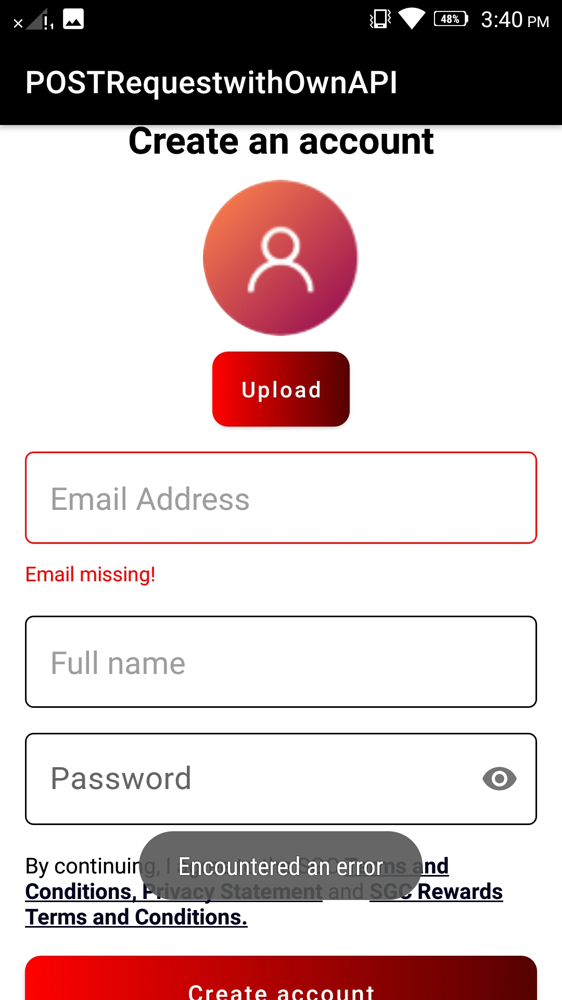

# Welcome to POSTRequestwithOwnAPI Repo!⌚️

---

## <summary>About POSTRequestwithOwnAPI</summary>

- Although the package is named POSTRequestwithOwnAPI as initially only POST practise was planned, other methods are also used in this project. Simple POST and GET methods are used at first stage where user enters datas at given fields and clicks button. The datas are created in db.json file with unique ID and user can view list of all datas below the input field which he/she can refresh to get latest datas too.

- This repo contains development of personal app for practising Retrofit - a library for REST API. Simply, a local server is hosted using json-server and app connects via ADB reverse socket. Internet permissions is required in manifest file for possible connectivity.

- Along with API practices (different HTTP methods), validaors are used to submit legit data. A dummy sign up form has been created at app which lets user enter email, name and password. In each field, validaors are kept that show animation and UI-friendly error if entered incorrectly. Other practices are also done such as Configuration Change Handling, Exception Handling, Upload photo from gallery, Bottom Sheet, etc.


---
<details>
<summary> Instructions </summary>

Before running the app, make sure you have required packages installed and do follwing:

### - Setup json server using
```
	json-server --watch db.json
```

 This hosts a server in localhost probably with port 3000 by default. The file db.json contains json data so run the command in the directory where db.json exists. <br>
 If there is no db.json file, an empty db.json file will be initialized.
 
### - Setup ADB Reverse socket using
```
	adb reverse tcp:3000 tcp:3000
```
 
 This setups a reverse port forwarding of traffic from port 3000. Remember, enter the port that the json server is used on!
 It is important step for the app to connect to local server hosted in machine. 

</details>

---
   
   
   
<details>

<summary> Some Screenshots from UI Development: </summary>
 
<p align="center">
    
    
</p>

<p align="center">
    
    
</p>

<p align="center">
    
    
    
</p>

<p align="center">
    
    
</p>
   
</details>


---
